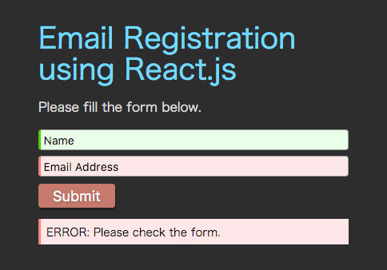

# React.js Tutorial for Beginners - Email Registration Form

This is a source code for my tutorial. For detail, please check the link below.

[Official Tutorial Page](http://www.mokuji.me/article/reactjs-tutorial-for-beginners-email-registration)

This is what a form looks like:



### Running

> You need [npm](https://www.npmjs.org/) installed on your computer.

From the root project directory, run the command below to install dependencies:
```bash
$ npm install
```

To build the project, first run this command:
```bash
$ npm start
```

This will start a watacher process that will update bundle.js with any changes.

To build a minified version, run this command:
```bash
$ npm run build
```
This will output bundle.min.js in the js directory.

To run the app, just open the index.html file in a browser.